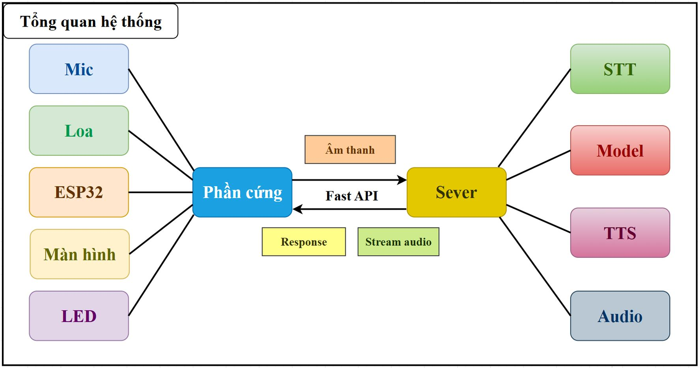
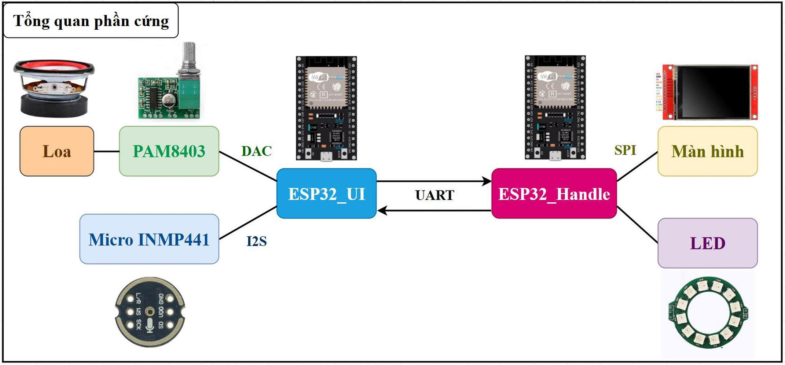
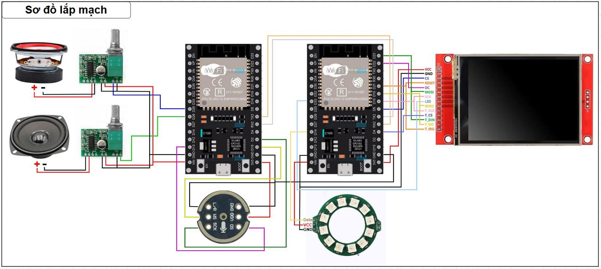
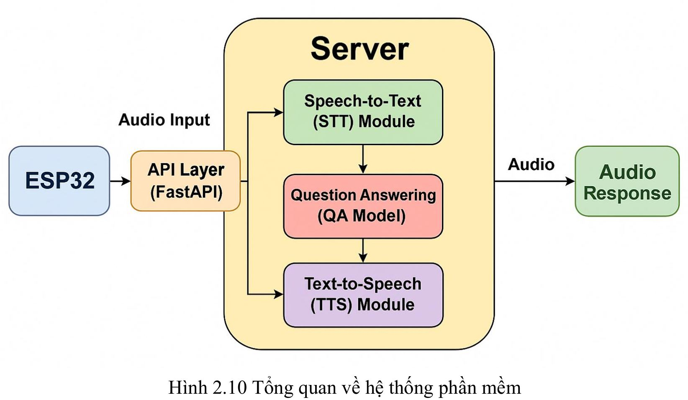
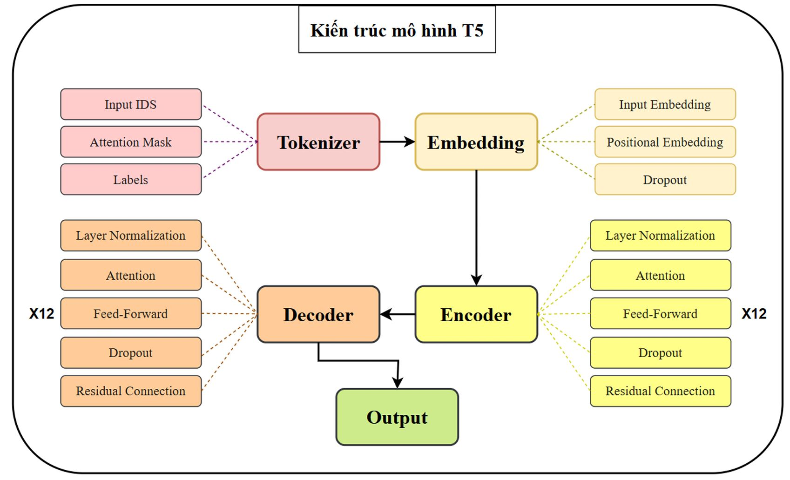
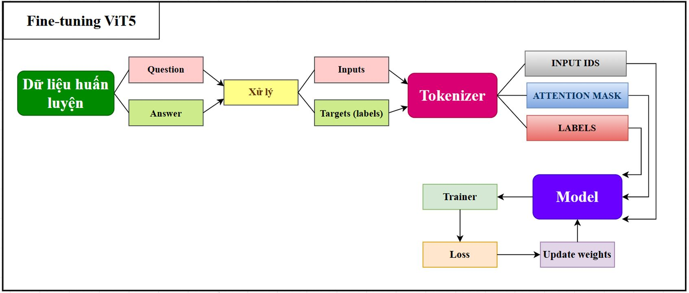
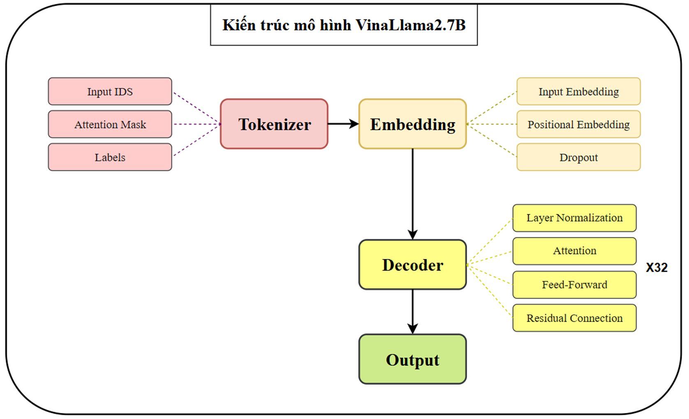
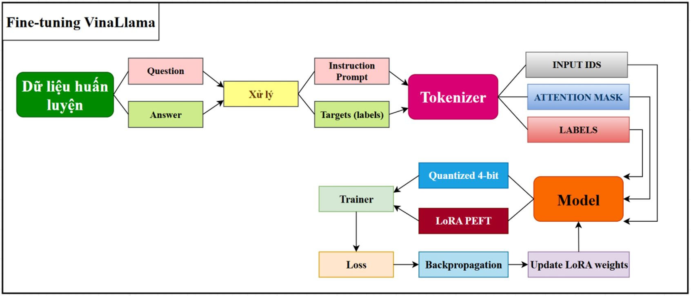
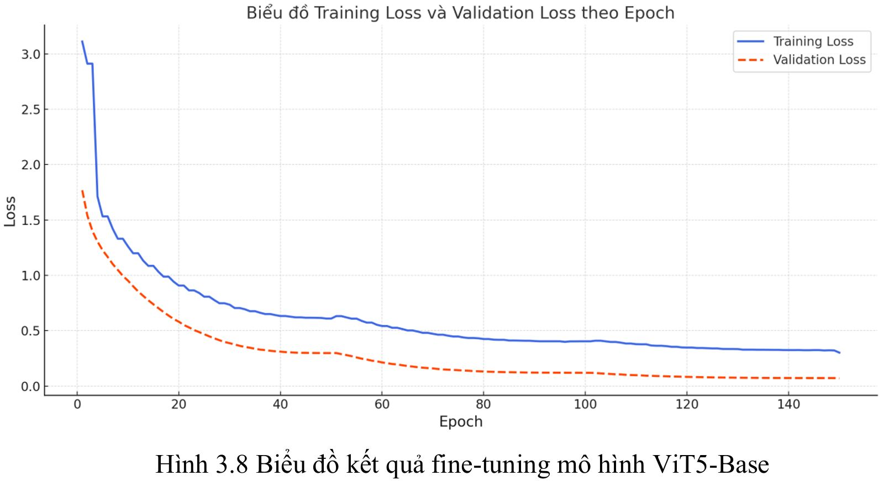
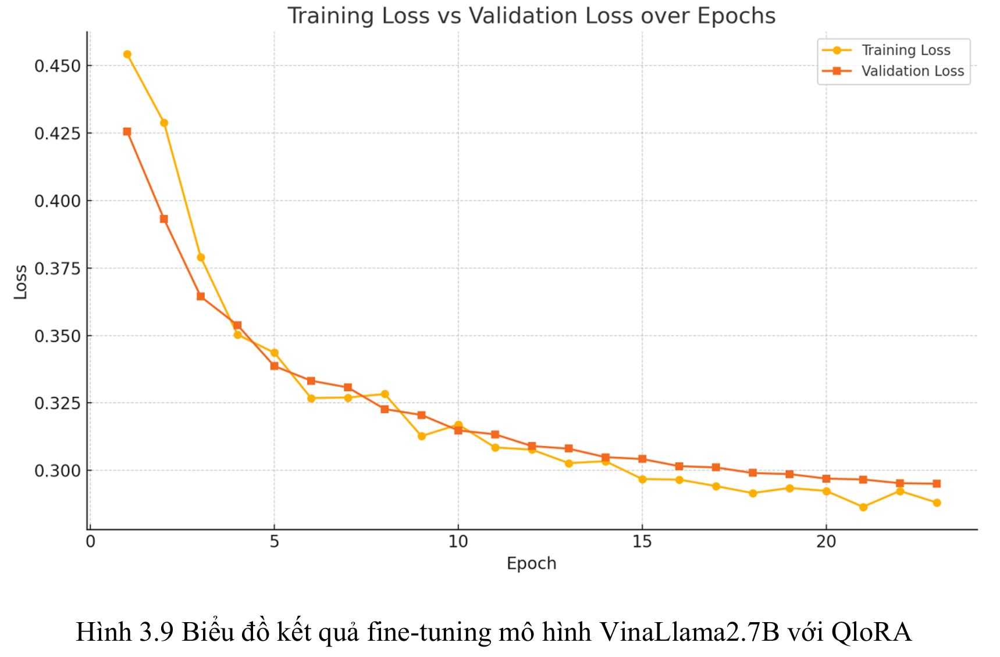

# 🤖 Intelligent System for Disease-Related Question Answering 

> An **AI** + **IoT**-powered system for automatic disease-related Q&A via voice, helping users access **fast – accurate – user-friendly** medical information.

---

## ▶️ Demo Video


📺 Watch the demo video **[here](https://youtu.be/j2nC14IqkZw)**

---

## 📜 Introduction

The **Intelligent System for Disease-Related Question Answering** is designed to:
- Provide **accurate medical information** (compiled from ~ **1000 common diseases in Vietnam**).
- Support **all types of users** – especially **elderly people, people with disabilities, those with mobility issues**, or individuals who find it difficult to use technology devices.
- Integrate **Natural Language Processing (NLP)**, **Large Language Models (LLM)**, and **IoT hardware** to deliver an **interactive, seamless, and user-friendly** experience.

---

## 🔧 Key Features

- 🗣 **Speech-to-Text (STT)** – Convert spoken language into text.
- 🤖 **Automated Q&A** – Powered by **VinaLLaMA 2.7B** and **ViT5** (fine-tuned) for accurate answers.
- 🔊 **Text-to-Speech (TTS)** – Read answers aloud to the user.
- 💡 **Intuitive Hardware Interface** – TFT LCD display, status LED, microphone, and speaker.
- 🌐 **IoT Connectivity** – ESP32 communicates with the server via **FastAPI**.

---

## 🛠️ System Architecture



The system includes:
1. **Hardware Device** – ESP32 + screen + microphone + speaker + LED.
2. **AI Processing Server** – Running NLP models & APIs.
3. **Supporting Services** – Speech-to-Text, Text-to-Speech.

---

## 🧠 Technologies Used

- **Programming Languages**: Python, C++ (Arduino ESP32)
- **Framework**: FastAPI
- **AI Models**: VinaLLaMA 2.7B, ViT5
- **Optimization Techniques**: QLoRA, Fine-tuning, Prompt Tuning
- **Hardware**:
  - ESP32
  - INMP441 Microphone
  - 2.4-inch TFT LCD Display
  - Mini Speaker
  - NeoPixel WS2812 LED

---

## 🖼️ Images

### 🎨 System Design
| | | | |
|---|---|---|---|
|  |  |  |  |

### 🚧 Deep Learning Model Development
| | | | |
|---|---|---|---|
|  |  |  |  |

### 📊 Model Training Results
| | |
|---|---|
|  |  |

---

## 🏆 Results

### 📈 Quantitative Evaluation
| Model | BLEU ↑ | ROUGE-2 ↑ | ROUGE-L ↑ |
|-------|--------|-----------|-----------|
| ViT5  | 82.03   | 0.9242      | 0.9359      |
| VinaLLaMA 2.7B | 32.25 | 0.3201  | 0.4972 |

---

### 📉 Qualitative Evaluation (Scale 1 – 5)

| **Criteria** | **ViT5-Base** | **VinaLLaMA 2.7B** |
|--------------|--------------|--------------------|
| Medical accuracy | **5** | 4 |
| Clarity & understandability | 4 | **5** |
| Naturalness & flexibility of expression | 3 | **5** |
| Overall satisfaction | 4 | 4 |

---

## 📂 Data

The dataset for this project was collected from **Tâm Anh Hospital**'s medical resources, which include articles, reports, and expert-verified health information.

- **Source**: Official medical content from [Tâm Anh Hospital]([https://tamanhhospital.vn/](https://tamanhhospital.vn/benh-hoc-a-z/))
- **Processing**:
  1. Raw medical articles were scraped and cleaned to remove HTML tags, advertisements, and unrelated content.
  2. Content was segmented into disease-specific topics (covering ~1000 common diseases in Vietnam).
  3. An automated question generation and answer extraction pipeline was applied, using NLP techniques and manual review to ensure medical accuracy.
- **Output**:  
  - ~20,000 **high-quality** question–answer pairs about diseases.
  - Each Q&A is **contextually relevant**, **medically accurate**, and **easy to understand**.
  - Questions cover multiple aspects of each disease: causes, symptoms, prevention, treatment, and follow-up care.

> 🩺 The dataset plays a crucial role in fine-tuning the **ViT5** and **VinaLLaMA 2.7B** models for Vietnamese medical question answering.

---

## 📚 References

- [FastAPI Documentation](https://fastapi.tiangolo.com/) – Lightweight, fast, and powerful Python backend framework.
- [Hugging Face Transformers](https://huggingface.co/docs/transformers/index) – Library for implementing and training NLP models.
- [QLoRA: Efficient Finetuning of Quantized LLMs](https://arxiv.org/abs/2305.14314) – Efficient fine-tuning method for large language models.
- [ESP32 Official Documentation](https://docs.espressif.com/projects/esp-idf/en/latest/esp32/) – Official documentation for the ESP32 microcontroller.

---

## 💻 Installation & Running Guide

1. **Clone the project**
   ```bash
   git clone https://github.com/username/medical-qa-ai.git
   cd medical-qa-ai
2. **Install dependencies**
   ```bash
   pip install -r requirements.txt
3. **Run the server**
   ```bash
   uvicorn main:app --reload

---

##  📞 Contact
- 📧 Email: tttiuem2k3@gmail.com
- 👥 Linkedin: [Thịnh Trần](https://www.linkedin.com/in/thinh-tran-04122k3/)
- 💬 Zalo / Phone: +84 329966939 | +84 336639775

---


   
