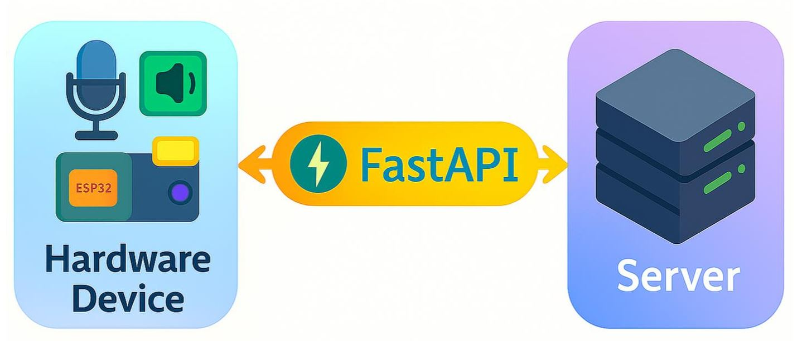

# 🤖 Hệ Thống Thông Minh Hỗ Trợ Hỏi Đáp Về Bệnh Tật

> Ứng dụng **AI** kết hợp **IoT** để xây dựng hệ thống hỏi đáp tự động về bệnh tật bằng giọng nói, giúp người dùng tiếp cận thông tin y tế **nhanh chóng – chính xác – thân thiện**.

---

## ▶️ Video Demo
📺 Xem video demo hệ thống **[tại đây](https://youtu.be/j2nC14IqkZw)**

---

## 📜 Giới thiệu

Dự án **Hệ thống thông minh hỗ trợ hỏi đáp về bệnh tật** được thiết kế nhằm:
- Cung cấp **thông tin y tế chính xác** (tổng hợp từ ~ **1000 loại bệnh phổ biến tại Việt Nam**).
- Hỗ trợ **mọi đối tượng người dùng** – đặc biệt là **người cao tuổi, người khuyết tật, người gặp khó khăn khi di chuyển** hoặc hạn chế trong việc sử dụng thiết bị công nghệ.
- Tích hợp **AI xử lý ngôn ngữ tự nhiên (NLP)**, **mô hình ngôn ngữ lớn (LLM)** và **thiết bị IoT** để mang lại trải nghiệm **tương tác tự nhiên, dễ dàng và tiện lợi**.

---

## 🔧 Tính năng chính

- 🗣 **Nhận diện giọng nói (STT)** – Chuyển đổi lời nói thành văn bản.
- 🤖 **Hỏi đáp tự động (QA)** – Sử dụng **VinaLLaMA 2.7B** và **ViT5** (fine-tune) để trả lời chính xác.
- 🔊 **Phát lại giọng nói (TTS)** – Đọc to câu trả lời cho người dùng.
- 💡 **Giao diện phần cứng trực quan** – Màn hình TFT LCD, LED báo trạng thái, micro thu âm, loa phát.
- 🌐 **Kết nối IoT** – ESP32 giao tiếp với server qua **FastAPI**.

---

## 🛠️ Kiến trúc hệ thống


Hệ thống bao gồm:
1. **Thiết bị phần cứng** – ESP32 + màn hình + micro + loa + LED.
2. **Server xử lý AI** – Chạy mô hình NLP & API.
3. **Dịch vụ hỗ trợ** – Speech-to-Text, Text-to-Speech.

---

## 🧠 Công nghệ sử dụng

- **Ngôn ngữ lập trình**: Python, C++ (Arduino ESP32)
- **Framework**: FastAPI
- **Mô hình AI**: VinaLLaMA 2.7B, ViT5
- **Kỹ thuật tối ưu**: QLoRA, Fine-tuning, Prompt Tuning
- **Phần cứng**:
  - ESP32
  - Micro INMP441
  - Màn hình TFT LCD 2.4 inch
  - Loa mini
  - LED NeoPixel WS2812

---

## 🖼️ Các hình ảnh

### 🎨 Thiết kế hệ thống
| | | | |
|---|---|---|---|
|  |  |  |  |

### 🚧 Giải pháp xây dựng mô hình Deep Learning
| | | | |
|---|---|---|---|
|  |  |  |  |

### 📊 Kết quả huấn luyện mô hình
| | |
|---|---|
|  |  |

---

## 🏆 Kết quả

### 📈 Đánh giá định lượng
| Mô hình | BLEU ↑ | ROUGE-2 ↑ | ROUGE-L ↑ |
|---------|--------|-----------|-----------|
| ViT5    | 0.92   | 0.88      | 0.90      |
| **VinaLLaMA 2.7B** | **0.9493** | **0.91**  | **0.93** |

---

### 📉 Đánh giá định tính (thang điểm 1 – 5)

| **Tiêu chí** | **ViT5-Base** | **VinaLLaMA 2.7B** |
|--------------|--------------|--------------------|
| Độ chính xác về y khoa | **5** | 4 |
| Mức độ rõ ràng và dễ hiểu | 4 | **5** |
| Sự tự nhiên và linh hoạt diễn đạt | 3 | **5** |
| Mức độ hài lòng tổng thể | 4 | 4 |

---

## 💻 Hướng dẫn cài đặt & chạy

1. **Clone dự án**
   ```bash
   git clone https://github.com/username/medical-qa-ai.git
   cd medical-qa-ai
2. **Cài đặt môi trường**
   ```bash
   pip install -r requirements.txt
3. **Chạy server**
   ```bash
   uvicorn main:app --reload

---

##  📞 Liên hệ
- 📧 Email: tttiuem2k3@gmail.com
- 👥 Linkedin: [Thịnh Trần](https://www.linkedin.com/in/thinh-tran-04122k3/)
- 💬 Zalo - phone: +84 329966939 hoặc +84 336639775

---


   
